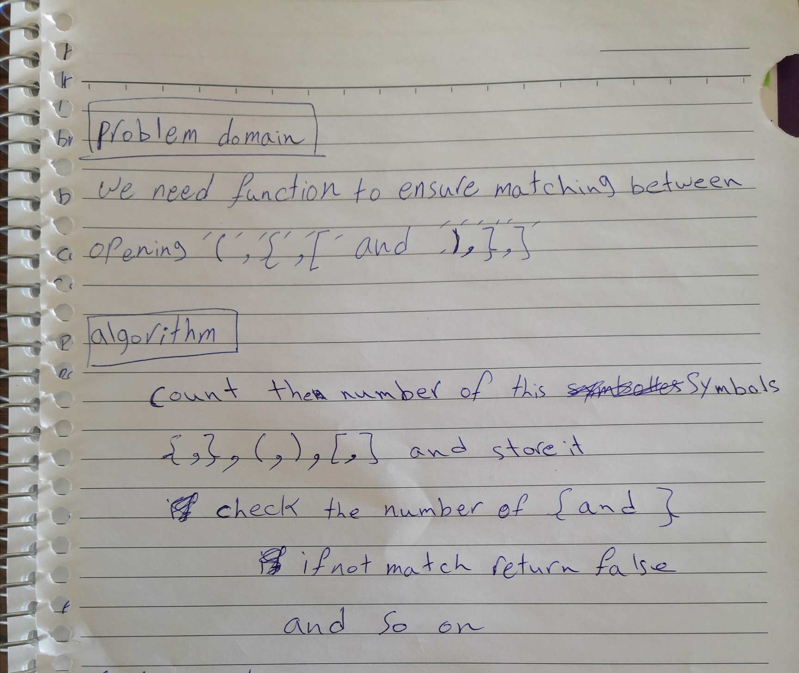

## Challenge Summary

function to ensure matching between opening (,{,[ and ],},)

**Feature Tasks**
if any missing (,[,{ or },],) will return specific message  
if all type of parentheses matched will return true

